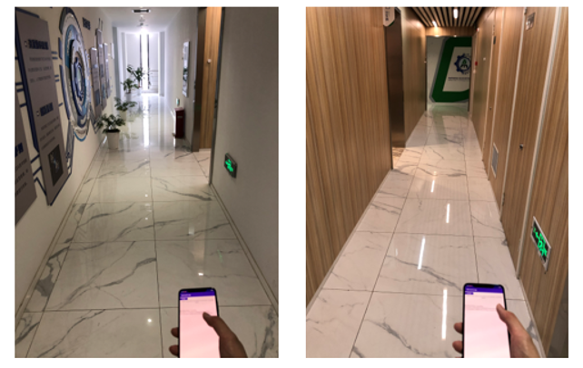
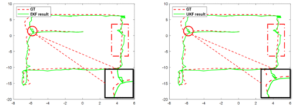
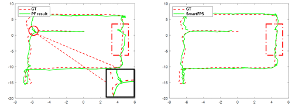
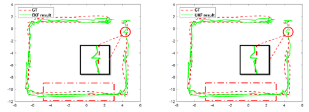
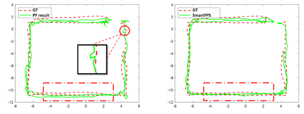

# DEEPWIF
**DEEPWIF** is a open source project initiated by ASIC Center laboratory, Southeast University, Nanjing, China.
DEEPWIF is an end-to-end trainable model for wireless-inertial fusion navigation appling several deep learning methods. The experiments shows our model can achieve remarkable results in complicated indoor positioning environments.
 
 

Performing localization in the hallway
 
 

 

 

Experiment results of filter methods and DEEPWIF
 
 

**Dataset**: (1-9 are training and test set for DEEPWIF, gan_1 and gan_2 are collected for transfer learning purpose) 

ar_acce: accelerometer in AR device 
        ----  timestamp (second), x, y, z 
ar_gravity: gravity in AR device 
        ----  timestamp (second), x, y, z 
ar_gyro: gyroscope in AR device 
        ----  timestamp (second), x, y, z 
ar_pose: pose estimation by AR device 
        ----  timestamp (second), x, y, z, qx, qy, qz, qw 
imu_acce: accelerometer in test device 
        ----  Android_Time_s_ (second), Unix_time_ms_ (millisecond), x, y, z 
imu_ble: bluetooth rssi received by test device  
        ----  Android_Time_s_ (second),E1,DC,E2,DD,E3,E5,EA,DB,DF,DE,E6,DA,EB,E9,E4,D9,EC,E7,E8,E0 (addresses for 20 beacons) 
imu_game_rv: bluetooth rssi received by test device 
        ----  Android_Time_s_ (second), Unix_time_ms_ (millisecond), x, y, z, w 
imu_gravity: gravity in test device 
        ----  Android_Time_s_ (second), Unix_time_ms_ (millisecond), x, y, z 
imu_gyro: gyroscope in test device 
        ----  Android_Time_s_ (second), Unix_time_ms_ (millisecond), x, y, z 
info:  
        ----  imu_delay (for time synchronization) 
              R_LI2LT (rotation matrix to translate local device coordinate system to AR phone coordinate system)   

**File Organization**:  
-- DEEPWIF 
    ---- bt_prep.py: preprocess bluetooth rssi data 
    ---- imu_en.py: inertial encoder model 
    ---- wl_en.py: wireless positioning model 
    ---- wif_deep_env.py: merge all environment infos for DEEPWIF 
    ---- wif_deep.py: DEEPWIF model 
    ---- wif_main.py: train and test models 
    ---- utils.py: utilities required by all files under the folder 
    ---- plot_estgt.py: Plot trajectory results 
    ---- run.json: defined parameters for datasets and models 
    ---- run.sh: for automation of all commands   

**Usage** (Choose Python or Shell):  
A. Python 
For the inertial encoder:
1) Training set: python3 ./DEEPWIF/wif_main.py -m trainset -M io
2) Train model: python3 ./DEEPWIF/wif_main.py -m train -M io -se 1 -emd **
3) Test set: python3 ./DEEPWIF/wif_main.py -m testset -M io 
4) Test model: python3 ./DEEPWIF/wif_main.py -m test -M io --epochmodeldest ** --withmodelepoch 1

For the wireless positioning encoder:
1) Preprocess bluetooth rssi dataset: python3 ./DEEPWIF/bt_prep.py
2) Train model: python3 ./DEEPWIF/wif_main.py -m train -M vlp
3) Test model: python3 ./DEEPWIF/wif_main.py -m test -M vlp

For DEEPWIF:
1) Training set: python3 ./RoV/wif_main.py -m trainset -M rov 
2) Train model: python3 ./RoV/wif_main.py -m train -M rov -se 1 -emd **
3) Test set: python3 ./RoV/wif_main.py -m testset -M rov
4) Test model: python3 ./RoV/wif_main.py -m test -M rov --epochmodeldest ** --withmodelepoch 2

B. Shell
1) ./DEEPWIF/run.sh   

**Required library version**: (We listed all environments here. Not all libs are required.)  
absl-py                 0.15.0 
astunparse              1.6.3 
backcall                0.2.0 
cached-property         1.5.2 
cachetools              5.0.0 
certifi                 2021.10.8 
charset-normalizer      2.0.12 
cycler                  0.11.0 
decorator               5.1.1 
flatbuffers             1.12 
fonttools               4.31.2 
gast                    0.3.3 
google-auth             2.6.2 
google-auth-oauthlib    0.4.6 
google-pasta            0.2.0 
grpcio                  1.32.0 
h5py                    2.10.0 
idna                    3.3 
importlib-metadata      4.11.3 
ipython                 7.33.0 
jedi                    0.18.1 
joblib                  1.1.0 
Keras-Preprocessing     1.1.2 
keras-tuner             1.1.2 
kiwisolver              1.4.0 
kt-legacy               1.0.4 
llvmlite                0.38.0 
Markdown                3.3.6 
matplotlib              3.5.1 
matplotlib-inline       0.1.3 
numba                   0.55.1 
numpy                   1.19.5 
numpy-quaternion        2022.2.10.14.20.39 
oauthlib                3.2.0 
opt-einsum              3.3.0 
packaging               21.3 
pandas                  1.1.5 
parso                   0.8.3 
pathlib                 1.0.1 
patsy                   0.5.2 
pexpect                 4.8.0 
pickleshare             0.7.5 
Pillow                  9.0.1 
pip                     22.0.4 
plyfile                 0.7.4 
prompt-toolkit          3.0.29 
protobuf                3.19.4 
ptyprocess              0.7.0 
pyasn1                  0.4.8 
pyasn1-modules          0.2.8 
Pygments                2.12.0 
pyparsing               3.0.7 
python-dateutil         2.8.2 
pytz                    2022.1 
requests                2.27.1 
requests-oauthlib       1.3.1 
rsa                     4.8 
scikit-learn            1.0.2 
scipy                   1.7.3 
seaborn                 0.11.2 
setuptools              60.10.0 
six                     1.15.0 
statsmodels             0.13.2 
tensorboard             2.8.0 
tensorboard-data-server 0.6.1 
tensorboard-plugin-wit  1.8.1 
tensorboardX            2.5 
tensorflow-addons       0.17.1 
tensorflow-estimator    2.4.0 
tensorflow-gpu          2.4.0 
termcolor               1.1.0 
threadpoolctl           3.1.0 
tqdm                    4.63.1 
traitlets               5.1.1 
typeguard               2.13.3 
typing_extensions       4.1.1 
urllib3                 1.26.9 
wcwidth                 0.2.5 
Werkzeug                2.0.3 
wheel                   0.37.1 
wrapt                   1.12.1 
zipp                    3.7.0 